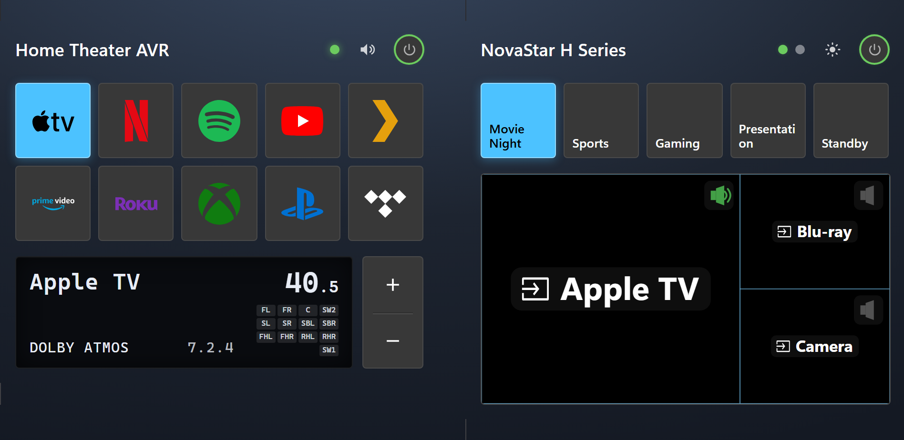
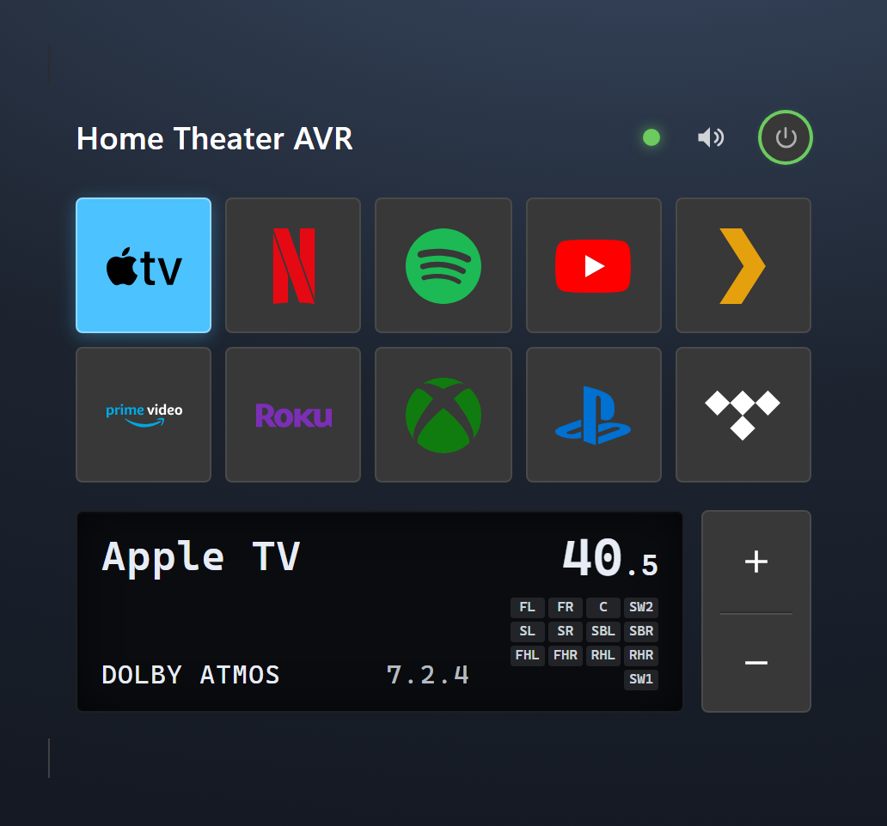
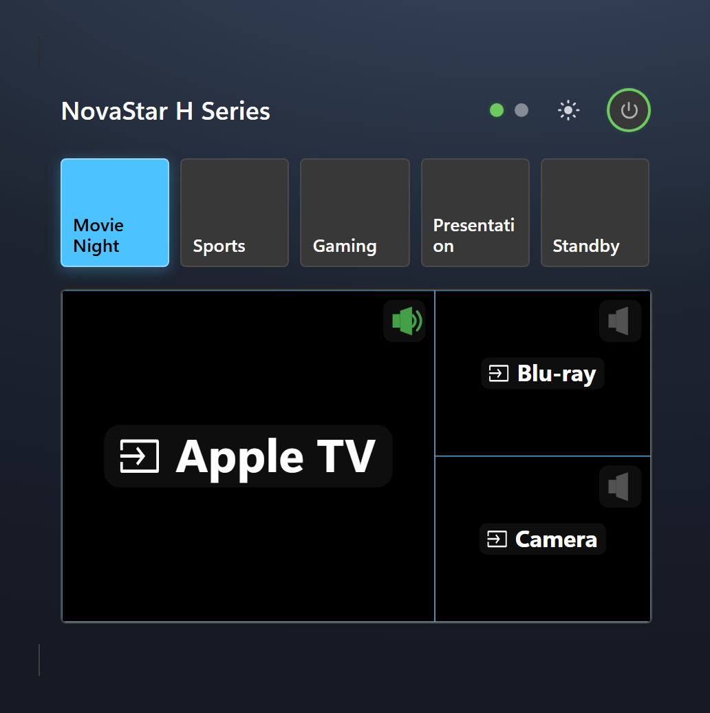

[](https://github.com/hacs/integration)     [](LICENSE)

> **⚠️ Interim release — testing only.** This is a pre-release build published for testing purposes only and is not intended for production use. Features may change or break without notice.

# Ted's Device Cards

A collection of custom [Home Assistant](https://www.home-assistant.io/) Lovelace cards for **specific devices** — AV receivers, video-wall controllers, and more.

Each card is paired with a particular device integration and gives it a polished, touch-friendly control surface. The whole collection shares the same look and feel as my [Ted's Cards](https://github.com/tedr91/HA-Teds-Cards) project — a self-contained "Ted's Home Theater" style (a Windows 11 Fluent / Mica-dark appearance) that looks the same regardless of your Home Assistant theme, or that can follow your active theme instead.

> 💡 [Ted's Cards](https://github.com/tedr91/HA-Teds-Cards) is the companion general-purpose card collection. These device cards are designed to sit alongside it with a consistent visual language.

---

## ✨ Card Types

| Card | Type | Description |
| --- | --- | --- |
| [Ted AV Receiver Card](#ted-av-receiver-card) | `custom:ted-av-receiver-card` | AVR control card (power, volume, and input-source selection) for the Denon/Marantz integration, with an AVR-style display panel. |
| [Ted NovaStar H Card](#ted-novastar-h-card) | `custom:ted-novastar-card` | Control card for the NovaStar H Series video-wall controller (power, brightness, presets, and an interactive screen-layout preview). |

More device cards will be added over time.

---

## 📸 Screenshots



---

## 🔧 Requirements

* Home Assistant
* [HACS](https://hacs.xyz/) (recommended for installation and updates)
* The **device integration** that matches each card you want to use:
  * **Ted AV Receiver Card** → the [HA-DenonMarantz](https://github.com/tedr91/HA-DenonMarantz) integration.
  * **Ted NovaStar H Card** → the [HA-novastar-h](https://github.com/tedr91/HA-novastar-h) integration.

You only need the integration(s) for the card(s) you actually use.

---

## 🚀 Installation

### Recommended: Install via HACS

This repository is distributed as a **custom HACS repository**.

[](https://my.home-assistant.io/redirect/hacs_repository/?owner=tedr91&repository=Teds-Cards-Devices&category=dashboard)

OR

<details>
<summary>Add custom repository</summary>

1. Open HACS in Home Assistant.
2. Go to the menu (⋮) → **Custom repositories**.
3. Add `https://github.com/tedr91/Teds-Cards-Devices` with category **Dashboard**.
4. Search for **Ted's Device Cards** and install.
5. Refresh your browser.

</details>

👉 If you don't have HACS yet, follow: [https://hacs.xyz/docs/use/](https://hacs.xyz/docs/use/)

---

### Manual Installation

<details>

<summary>Without HACS</summary>

1. Download `teds-device-cards.js` from the [latest release](https://github.com/tedr91/Teds-Cards-Devices/releases/latest).
2. Copy it to `<config>/www/community/teds-device-cards/teds-device-cards.js`.
3. Add the resource to your dashboard:
   - **Settings** → **Dashboards** → ⋮ → **Resources** → **Add resource**
   - URL: `/local/community/teds-device-cards/teds-device-cards.js`
   - Type: **JavaScript Module**
4. Refresh your browser.

💡 After updates, bump the version (`?v=2`) to avoid caching issues.

</details>

---

## 📖 Usage

All cards include a **visual Lovelace card editor** in the dashboard UI, so you can configure them without writing YAML. The YAML options below are available for power users.

Both cards share two theme styles via the `theme` option:

- `ted-style` (default): a self-contained "Ted's Home Theater" appearance — a Windows 11 Fluent (Mica-dark) style — that looks the same regardless of your Home Assistant theme.
- `ha`: follow the active Home Assistant theme (accent color, surfaces, and corner radius).

### Ted AV Receiver Card

A polished AVR control card with power, volume, and input-source selection, plus an AVR-style display panel. Requires the [HA-DenonMarantz](https://github.com/tedr91/HA-DenonMarantz) integration.

<p align="center">
  
</p>

Minimal config:

```yaml
type: custom:ted-av-receiver-card
device_id: YOUR_DEVICE_ID
```

`device_id` is recommended — when set, the card automatically resolves the AVR's `media_player` and input-source entities. All other fields are optional.

<details>
<summary><b>Detailed options</b></summary>

```yaml
type: custom:ted-av-receiver-card
header: Home Theater AVR
theme: ted-style
device_id: YOUR_DEVICE_ID
source_icons: color
show_display: true
show_volume_buttons: true
show_sources: true
section_order: [display, sources]
show_card_version: false
```

| Option | Default | Description |
| --- | --- | --- |
| `header` | media player name | Title shown in the card header. |
| `theme` | `ted-style` | `ted-style` (self-contained) or `ha` (follow Home Assistant theme). |
| `device_id` | — | The Denon/Marantz device; auto-resolves all entities. |
| `source_icons` | `color` | Brand/category icon above each source button: `color`, `monochrome`, or `off`. |
| `source_order` | — | Choose which sources appear and in what order (draggable chips in the editor). Reset automatically if the device's sources change. |
| `max_rows` | `0` | Max number of 5-wide rows of source buttons before an overflow “…” button (opens a chooser). `0` = unlimited. |
| `show_display` | `true` | Show the AVR-style display panel (source, volume, sound mode, channel layout, active-speaker diagram). |
| `show_volume_buttons` | `true` | Show a vertical volume +/- stepper beside the display panel. |
| `show_sources` | `true` | Show the input-source button grid (when the receiver is on). |
| `show_status` | `true` | Show the status icon (connection dot) in the header. |
| `show_volume` | `true` | Show the volume control in the header. |
| `section_order` | `[sources, display]` | Order of the **display** and **sources** sections (drag to reorder in the editor). |
| `status_order` | `[status, volume]` | Order of the header status items (status icon, volume) — drag to reorder in the **Status items** editor section. |
| `show_card_version` | `false` | Show the card version in a small footer. |

**Brand icons.** The card ships its own hand-tuned colour/monochrome icons for many popular sources — including Netflix, Spotify, YouTube, Plex, Prime Video, Apple TV, Roku, Steam, Xbox, Nintendo, PlayStation, Fire TV, HEOS, Tidal, Pandora, Nvidia, Cast, Sonos, Denon, Marantz, and Kaleidescape. Icons are matched from the source name; unmatched sources use a generic input glyph. For each source the card picks the first available of: its bundled icon → [Custom Brand Icons](https://github.com/elax46/custom-brand-icons) (`phu:`, if installed) → Material Design Icons (`mdi:`) → a generic glyph.

**Entity overrides.** The card resolves entities from `device_id`, but you can override any of them: `media_player_entity` (power, volume, mute, source), `source_entity` (a `select` input-source entity), `sound_mode_entity` (a `sensor` for the current sound mode / audio format), and `active_speakers_entity` (a `sensor` with `channels`/`layout` attributes that drives the speaker diagram).

</details>

### Ted NovaStar H Card

A control card for the NovaStar H Series video-wall controller — power, brightness, tappable presets, and an interactive screen-layout preview with per-layer source selection. Requires the [HA-novastar-h](https://github.com/tedr91/HA-novastar-h) integration.

<p align="center">
  
</p>

Minimal config:

```yaml
type: custom:ted-novastar-card
controller_entity: sensor.novastar_h_series_controller
```

`controller_entity` is required. All other fields are optional.

<details>
<summary><b>Detailed options</b></summary>

```yaml
type: custom:ted-novastar-card
header: NovaStar H Series
display_mode: standard
theme: ted-style
controller_entity: sensor.novastar_h_series_controller
status_entity: sensor.novastar_h_series_status
brightness_entity: number.novastar_h_series_brightness
temperature_entity: sensor.novastar_h_series_temperature
show_presets: true
show_layout: true
hide_presets_when_off: true
section_order: [presets, layout]
```

| Option | Default | Description |
| --- | --- | --- |
| `controller_entity` | **required** | The primary controller entity (drives the card). |
| `header` | `NovaStar H Series` | Title shown in the card header. |
| `display_mode` | `standard` | `standard` (default — streamlined controls with the layout preview as the centerpiece) or `compact` (layout visualization only). |
| `theme` | `ted-style` | `ted-style` (self-contained) or `ha` (follow Home Assistant theme). |
| `brushed` | `true` | Overlay a subtle brushed-metal sheen above the card background. |
| `show_header_in_compact` | `false` | Show the header (and power button) in compact mode. |
| `show_presets` / `show_layout` | `true` | Show the Presets section / Layout preview section. |
| `hide_presets_when_off` | `true` | Hide the Presets section while the power entity is off. |
| `section_order` | `[presets, layout]` | Order of the reorderable body sections (drag to reorder in the editor). |
| `status_order` | `[status, temperature, brightness]` | Order of the header status items — drag to reorder in the **Status items** editor section. |
| `show_status` / `show_temperature` / `show_brightness` | `true` | Show or hide each header status indicator (toggles in the **Status items** section). |
| `screen_color` / `screen_background_color` | — | Customize the layout-preview layer tone / screen backdrop (theme color name or hex). |
| `preset_order` | — | Choose which presets appear and in what order (draggable chips read live from the device). Reset automatically if the device's presets change. |
| `max_rows` | `0` | Max number of 5-wide rows of preset buttons before an overflow “…” button (opens a chooser). `0` = unlimited. |
| `show_card_version` | `false` | Show the card version in a small footer (standard mode). |

**Entity overrides.** Beyond `controller_entity`, optional entities enrich the card: `power_entity`, `preset_entity`, `screens_entity`, `layers_entity`, `status_entity`, `brightness_entity`, and `temperature_entity`. With a `device_id` set, the card can auto-resolve these from the NovaStar device.

</details>

---

## 📋 Changelog

The newest entry below is used as the GitHub Release notes by the release workflow, so it shows in the Home Assistant / HACS **update** dialog when you update. Newest first.

### v0.0.3

- **Status items are now drag-to-reorder** — each header indicator is a draggable row with a show/hide switch in its header (AV Receiver: status icon, volume; NovaStar H: status, temperature, brightness).
- **New “Max rows” option** on the AV Receiver's **Input sources** and the NovaStar's **Presets** — limit the 5-wide button grid to a set number of rows, with an overflow “…” chooser for the rest (`0` = unlimited). NovaStar presets now default to showing all; set **Max rows** to `1` for the previous single-row behavior.

### v0.0.2

- **Card sections now reorder by drag-and-drop** — grab the handle on a section row to rearrange them (replaces the up/down menu), matching Ted's Cards.
- **Section on/off toggles moved into the section headers** — flip a section's switch right from its heading (AV Receiver: front panel display / input sources; NovaStar H: presets / layout preview).
- **New "Status items" editor section** on both cards — AV Receiver: show or hide the header **status icon** and **volume**; NovaStar H: the status, temperature, and brightness entities, grouped in one place.
- **NovaStar H:** removed the **Detailed** display mode — the card is now **Standard** (default) or **Compact**.
- Fixed: collapsing one card section no longer also collapses the whole **Card sections** group.

### v0.0.1

- **New collection — Ted's Device Cards:** a HACS frontend bundle of device-specific Lovelace cards that share the look and feel of Ted's Cards.
- **New: Ted AV Receiver Card** (`custom:ted-av-receiver-card`) — control card for the Denon/Marantz AVR integration: power, header volume with mute, a brand-icon input-source grid, and an AVR-style display panel (source, volume, sound mode, channel layout, and active-speaker diagram). Includes a visual editor.
- **New: Ted NovaStar H Card** (`custom:ted-novastar-card`) — control card for the NovaStar H Series video-wall controller: power, brightness, tappable presets, and an interactive screen-layout preview with per-layer source selection. Three display modes and a visual editor.
- Interim release published for testing only.
